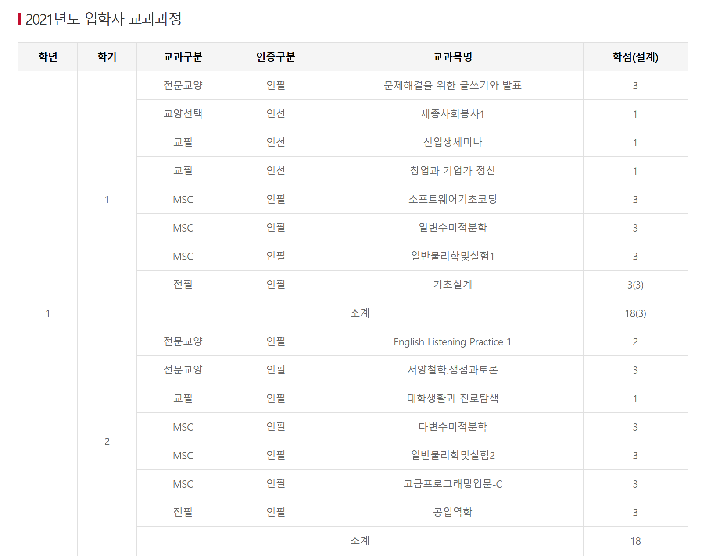

## 1) 공학인증 과목 CSV 생성 자동화
- 목적 : 공학인증 과목 테이블(`gonghak_course`) 데이터를 추가하기 위한 csv 파일을 생성
- 공학인증 요건표의 `<table>` 데이터를 파싱해 CSV로 생성 후, 파이썬 스크립트로 병합/중복 제거/정렬 수행
  - AI Skills : 입학년도별 `html` 파일을 CSV로 변환
  - Python : 생성한 CSV 파일을 병합/중복 제거 후 CSV로 저장
- 개선 효과
  - 요건 표를 직접 캡처해서 AI에게 전달하고, 이를 CSV로 변환하는 과정은 시간도 오래 걸리고, 수동으로 중복되는 과목을 찾아야 됨
  - 크롬 개발자 도구로 테이블 태그를 가져오기만 하면, AI 및 스크립트를 통해 추출/변환/병합까지 자동으로 처리 가능

### 공학인증 요건표


### 생성한 CSV 예시 (항공우주공학과.csv)
```csv
학과이름|과목이름|ABEEK 영역|과목 영역|설계학점
항공우주공학과|English Listening Practice 1|전문교양|필수|0
항공우주공학과|English Reading Practice 1|전문교양|필수|0
항공우주공학과|문제해결을 위한 글쓰기와 발표|전문교양|필수|0
항공우주공학과|서양철학:쟁점과토론|전문교양|필수|0
항공우주공학과|세계사:인간과 문명|전문교양|필수|0
... (전체 64개 과목)
```

- 설계학점 변환 : 괄호 안의 숫자를 그대로 사용, "없음"은 0으로 변환
- ABEEK 영역 변환 : "전필", "전선" -> "전공"
- 과목 영역 변환 : "인필" -> "필수", "인선" -> "선택"